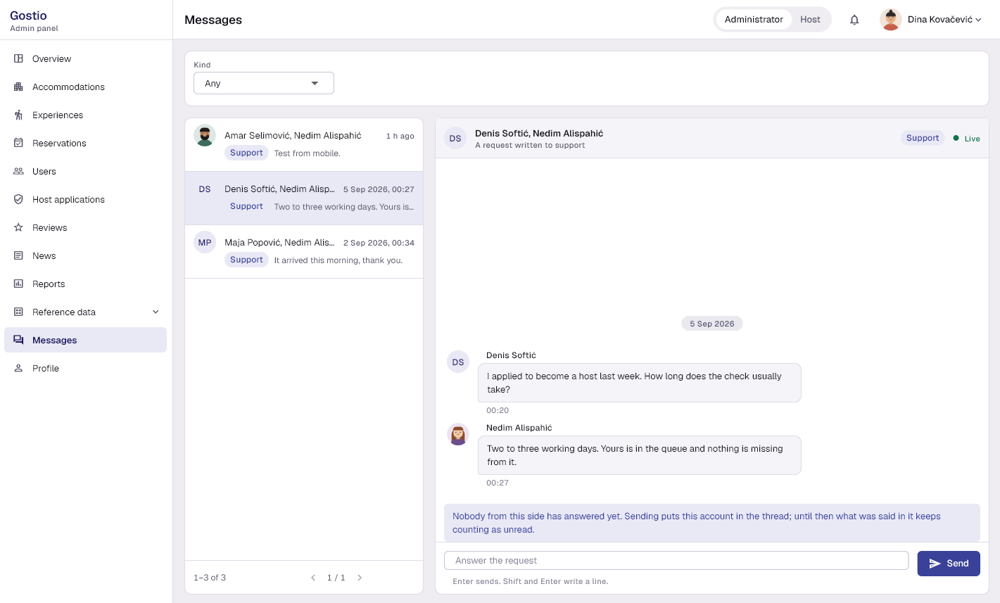

# Gostio

Booking platform for accommodations and experiences in Bosnia and Herzegovina —
ASP.NET Core REST API, a background worker over RabbitMQ, a Flutter desktop
client for administrators and hosts, and a Flutter mobile client for guests.

## Screenshots

Both clients, from release builds against a seeded database.

### Desktop — administrator and host panel

<p align="center">
  
  
  
</p>

### Mobile — guest

<p align="center">
  
  
  
</p>

## Applications

| App | Path | Purpose |
| --- | --- | --- |
| REST API and worker | `src/` | Catalogues, bookings, payments, chat, reports, queues |
| Desktop (admin + host) | `apps/gostio_desktop` | Reference data, host applications, news, reports, own listings |
| Mobile (guest) | `apps/gostio_mobile` | Browse and book, pay by Stripe, trips, chat, recommendations |
| Shared package | `packages/gostio_core` | Contract, API client, session, validation, brand |

## Test logins

Written by the seeder the first time the API starts against an empty database.
Every account uses the password **`test`** — `SEED_DEFAULT_PASSWORD` in `.env`.

| Context | Username | Password |
| --- | --- | --- |
| Desktop version | `desktop` | `test` |
| Mobile version | `mobile` | `test` |
| Single role | `administrator`, `host`, `guest` | `test` |

Eleven further seeded accounts give the catalogue, the bookings and the
recommendations data to stand on. They use the same password.

## Getting started

### Prerequisites

- Docker Desktop
- 7-Zip, WinRAR or PeaZip — Windows Explorer cannot open an encrypted archive
- Stripe CLI — only to settle a payment locally
- Flutter 3.47+ and the Android SDK — only for the clients

### Run the stack

1. Unpack `.env-tajne.zip` in place — it is the working `.env`, encrypted, and
   its password is handed over separately:

   ```powershell
   7z x .env-tajne.zip
   ```

   To work on the project instead, copy `.env.example` to `.env` and fill in
   the values it leaves empty. `DB_NAME`, `DB_SA_PASSWORD`, `JWT_KEY`, the two
   RabbitMQ credentials and `SEED_DEFAULT_PASSWORD` are needed to start; the
   SMTP, Stripe and Google Maps values are needed only by the features that
   call those services.

2. Bring the stack up:

   ```bash
   docker compose up -d --build
   ```

Four containers come up: SQL Server, RabbitMQ, the API and the worker. The API
creates its database, applies the migrations and seeds it on first start, so
nothing has to be run by hand. It listens on `http://localhost:5000` and serves
Swagger at `/swagger`.

### Settle a payment locally

Stripe confirms a booking through a signed webhook, so a charge made locally
settles only while the Stripe CLI is forwarding. The key is read from `.env`,
which no shell loads on its own:

```bash
set -a; source .env; set +a
stripe listen --api-key "$STRIPE_SECRET_KEY" --forward-to http://localhost:5000/api/payments/webhook
```

The `whsec_...` the listener prints has to match `STRIPE_WEBHOOK_SECRET`; the
delivered configuration already holds the one this account's CLI prints.
Without the forwarder the card is charged and the booking stays *Pending* —
only the signed webhook marks it paid.

### Run the clients

The API address is a compile-time constant, so it is passed on every run and
every build.

```bash
cd apps/gostio_desktop && flutter run -d windows --dart-define=API_BASE_URL=http://localhost:5000
cd apps/gostio_mobile  && flutter run --dart-define=API_BASE_URL=http://10.0.2.2:5000
```

Sign in as `desktop` / `test` on the desktop client — that account holds both
roles, so it opens on the administrator panel with a switch to the host one.

Either client checks itself with `dart format --set-exit-if-changed lib test`,
`flutter analyze` and `flutter test`. The backend does so with
`dotnet build -warnaserror` and `dotnet test`, which needs `gostio-db` up.

### Build for release

```bash
cd apps/gostio_desktop && flutter build windows --release --dart-define=API_BASE_URL=http://localhost:5000
cd apps/gostio_mobile  && flutter build apk --release --dart-define=API_BASE_URL=http://10.0.2.2:5000
```

The Windows build writes `build/windows/x64/runner/Release` — `Gostio.exe` and
the DLLs and `data` folder beside it, so the folder travels rather than the
executable alone. The Android build writes
`build/app/outputs/flutter-apk/app-release.apk`.

## Project structure

```
src/
  Gostio.API                REST API, SignalR hub, authentication, middleware
  Gostio.Model              requests, responses, enumerations, validation
  Gostio.Services           domain services, EF Core model, migrations, seeding
  Gostio.Worker             reservation and refund sweeps, queue consumers
tests/
  Gostio.Tests              unit and API tests
  Gostio.IntegrationTests   endpoint tests against SQL Server
apps/
  gostio_desktop            Flutter desktop client for administrators and hosts
  gostio_mobile             Flutter Android client for guests
packages/
  gostio_core               the contract, the session and the brand both clients share
docker-compose.yml          SQL Server, RabbitMQ, the API and the worker
```

## Technology

- **Backend:** .NET 10, ASP.NET Core, EF Core against SQL Server, Mapster, Swashbuckle
- **Auth:** JWT bearer, BCrypt password hashing, sign-out that invalidates the token
- **Payments:** Stripe PaymentSheet, settled by a signed webhook, refunds through the API
- **Messaging:** RabbitMQ with a queue each for email, notifications and push; MailKit and FCM
- **Real time:** SignalR chat
- **Clients:** Flutter
- **Infra:** Docker Compose (API, worker, SQL Server, RabbitMQ)

## Features

- Two catalogues — accommodations and experiences — with photos, amenities,
  availability and bookable terms, searched and paged on the server.
- Bookings with a state machine, a hold that expires, and a background sweep
  that expires and completes them on a timer.
- Payments through Stripe, refunds priced by a cancellation policy and sent by
  the worker.
- Reviews of finished stays, favourites, and host applications an administrator
  answers.
- Chat over SignalR, plus notifications, email and mobile push.
- Explainable content-based recommendations — see `recommender-dokumentacija.md`.
- Revenue and listing-performance PDF reports, saved or printed from the desktop.

## Security

- JWT with signature validation; signing out invalidates the token on the
  server rather than only dropping it on the client.
- Role-based authorisation, with ownership checked on every listing, booking,
  conversation and upload.
- Registration opens a guest account and carries no field that could grant a
  privilege.
- Uploaded images validated by their own bytes rather than by their extension.
- Five endpoints are reachable without a token: sign in, register, the two
  password-reset endpoints, and the payment webhook, which is authenticated by
  a signature over its raw body.

## Configuration

`.env` is gitignored and holds every secret the stack uses; `.env.example`
documents each value, and nothing in `src/`, `apps/` or `appsettings.json`
repeats any of them. The filled-in `.env` travels beside the template as the
AES-256 `.env-tajne.zip` and is never attached to a release.
