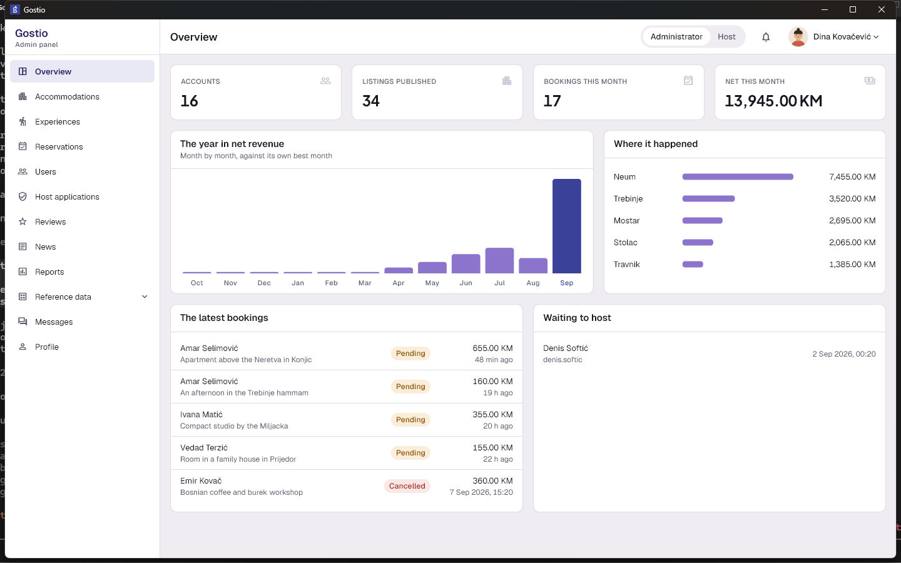
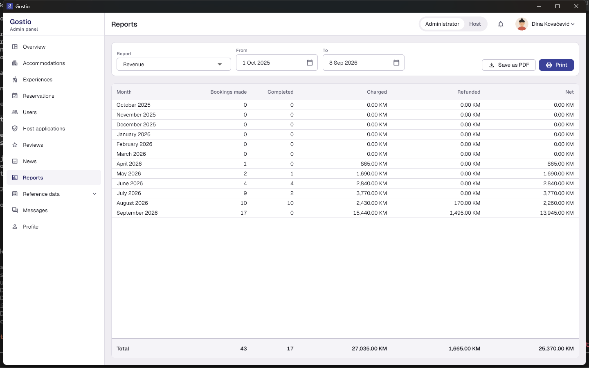
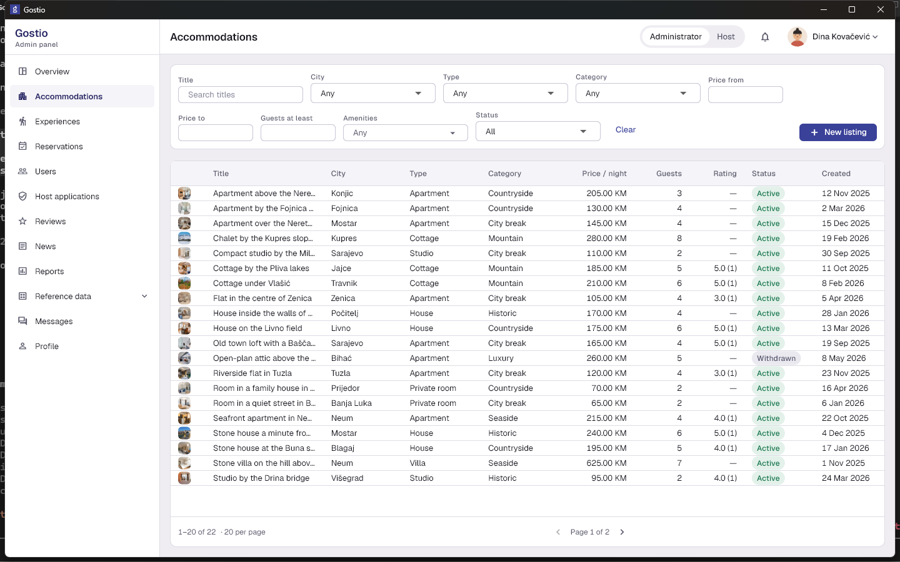
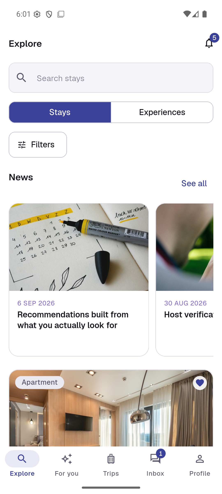
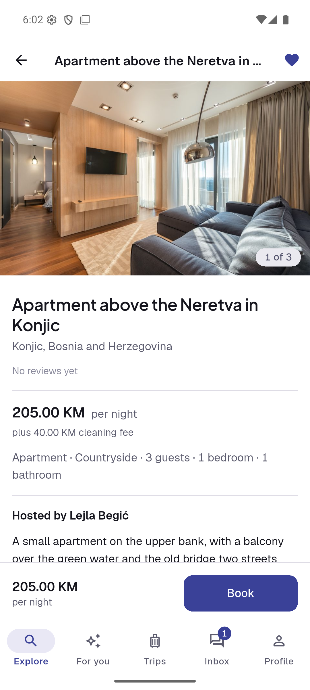
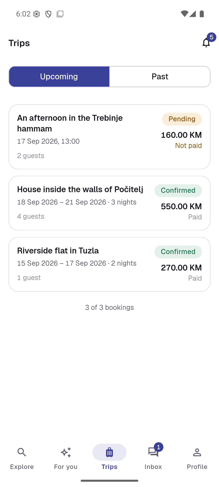

# Gostio

Gostio is a booking platform for accommodations and experiences in Bosnia and
Herzegovina. A guest browses the two catalogues, books a stay or a term, pays
for it and talks to the host; a host manages their listings and the bookings
made against them; an administrator manages the reference data, the host
applications, the news and the reports.

Gostio consists of a backend, a desktop client and a mobile client:

| Application | Audience | Location | State |
| --- | --- | --- | --- |
| REST API and background worker | both clients | `src/` | built |
| Desktop client | administrators and hosts | `apps/gostio_desktop` | built |
| Mobile client | guests | `apps/gostio_mobile` | built |

The two clients share one package. `packages/gostio_core` holds what belongs to
the product rather than to a client — the response models, the API client and
its interceptors, the session, the validation rules mirroring the server's, the
date and money formats, the palette and the three bundled faces. What stays in
each client is measurement and drawing: its own spacing and type scales, its own
widgets, notifiers and repositories. A client imports the one library the
package publishes and nothing inside it.

## Screenshots

Both clients, from release builds against a seeded database.

### Desktop — administrator and host panel

| Overview | Reports |
| --- | --- |
|  |  |



### Mobile — guest

| Explore | Listing | Trips |
| --- | --- | --- |
|  |  |  |

## Test accounts

Created by the seeder the first time the API starts against an empty database.
Every one of them uses the password `test`, which is `SEED_DEFAULT_PASSWORD`
in `.env`.

| Username | Roles | Used for |
| --- | --- | --- |
| `desktop` | Administrator, Host | the desktop client |
| `mobile` | Guest | the mobile client |
| `administrator` | Administrator | a single-role check |
| `host` | Host | a single-role check |
| `guest` | Guest | a single-role check |

The seed writes eleven further accounts so the catalogue, the bookings and the
recommendations have data behind them. They use the same password.

## Prerequisites

- Docker Desktop
- 7-Zip, WinRAR or PeaZip — to unpack the configuration archive; Windows
  Explorer cannot open an encrypted one
- Stripe CLI — only to settle a payment locally, see below
- .NET 10 SDK — only to build or test outside the containers
- Flutter 3.47 or later — only for the clients
- Android SDK and an emulator — only for the mobile client

## Running the stack

The stack reads `.env`, which is not in the repository. There are two ways to
have one, and which applies depends on why you are here.

**Reviewing a published build.** `.env-tajne.zip` sits in this folder beside
`.env.example`: it is the working `.env`, encrypted, and its password is handed
over separately from the repository. Unpack it in place and nothing else about
configuration has to be decided:

```powershell
7z x .env-tajne.zip
```

**Working on the project.** Start from the template instead:

```bash
cp .env.example .env
```

Fill in the values the template leaves empty. `DB_NAME`, `DB_SA_PASSWORD`,
`JWT_KEY`, the two RabbitMQ credentials and `SEED_DEFAULT_PASSWORD` are needed
to start; the SMTP, Stripe and Google Maps values are needed only by the
features that call those services, and each of them names the value it is
missing rather than failing at start-up.

Either way, one `.env` later:

```bash
docker compose up -d --build
```

Four containers come up: SQL Server, RabbitMQ, the API and the worker. The API
creates its database, applies the migrations and seeds it on first start, so
nothing has to be run by hand. It listens on `http://localhost:${API_HTTP_PORT}`
— `5000` unless the template was changed — and serves Swagger at `/swagger`
while `ASPNETCORE_ENVIRONMENT` is `Development`.

Stripe settles a payment through a webhook, so a charge made locally confirms
its booking only while the Stripe CLI is forwarding. The CLI needs the account's
secret key, and `.env` is not loaded into a shell on its own, so the key is read
from it explicitly. In Git Bash:

```bash
set -a; source .env; set +a
stripe listen --api-key "$STRIPE_SECRET_KEY" --forward-to http://localhost:5000/api/payments/webhook
```

In PowerShell:

```powershell
$key = (Get-Content .env | Select-String '^STRIPE_SECRET_KEY=').Line -replace '^STRIPE_SECRET_KEY=', ''
stripe listen --api-key $key --forward-to http://localhost:5000/api/payments/webhook
```

Passing the key this way means `stripe login` is not needed, so the forwarder
runs on a machine the CLI has never been signed in on.

Compare the `whsec_...` the listener prints with `STRIPE_WEBHOOK_SECRET` in
`.env`. They match here and the CLI keeps one secret across restarts, but the
webhook is authenticated by a signature over its raw body, so a mismatch is
rejected rather than merely unnoticed: if the two differ, put the printed value
in `.env` and restart the API.

Without the forwarder a card is charged and the booking stays *Pending*: the
client says the payment was sent but no confirmation has arrived and offers to
ask again, which is the truth about a settlement that is nobody's to invent. The
client never marks a booking paid on its own, and neither does the API — only
the signed webhook does.

### Building and testing outside the containers

```bash
docker compose up -d gostio-db
dotnet build -warnaserror
dotnet test
```

The integration suite runs against the database container, so it has to be up.

## Running the desktop client

The API address is a compile-time constant, read through
`String.fromEnvironment`, so it is passed on every run and every build. A build
made without it starts and then says it was given no address, which is the only
thing it can honestly do.

```bash
cd apps/gostio_desktop
flutter pub get
flutter run -d windows --dart-define=API_BASE_URL=http://localhost:5000
```

Sign in as `desktop` / `test`. That account holds both roles, so it opens on
the administrator panel with a switch to the host one beside the avatar.

Its own checks:

```bash
dart format --set-exit-if-changed lib test
flutter analyze
flutter test
```

## Running the mobile client

The address is passed the same way, and it is the one an Android emulator uses
to reach the host machine.

```bash
cd apps/gostio_mobile
flutter pub get
flutter run --dart-define=API_BASE_URL=http://10.0.2.2:5000
```

Its own checks are the desktop's three. The client is complete: signing in,
registration and password recovery; a five-tab shell over Explore, For you,
Trips, Inbox and Profile; the two catalogues searched and filtered, a listing
with its gallery, amenities, map and priced calendar, a booking against nights
or a term, and paying for it through the Stripe sheet; trips ahead and behind
with cancellation and its refund quote; reviews, favourites, explained
recommendations, chat over the hub, notices with the bell that polls for them,
the profile with its picture and password, and the application to host.

## Building for release

The build carries the address the same way the run does, and the address is the
one the machine running the build output will use — `localhost` for Windows,
and the emulator's `10.0.2.2` for Android.

```bash
cd apps/gostio_desktop
flutter clean
flutter build windows --release --dart-define=API_BASE_URL=http://localhost:5000
```

```bash
cd apps/gostio_mobile
flutter clean
flutter build apk --release --dart-define=API_BASE_URL=http://10.0.2.2:5000
```

The Windows build writes `build/windows/x64/runner/Release`. `Gostio.exe` is
its entry point and the DLLs and the `data` folder beside it travel with it, so
the folder is what gets distributed rather than the executable alone. The
Android build writes one file, `build/app/outputs/flutter-apk/app-release.apk`,
signed with the debug keys so it installs from a build alone.

A client proved only in debug is a client whose delivery is unproven. A release
build exercises Android's release packaging and normally invokes its lint task;
the documented waiver in `apps/gostio_mobile/README.md` explains why lint cannot
run here. The Windows folder carries the native halves of the plugins, so each
client is installed on the machine it is delivered for and driven there before
it is packed.

### The archive

One archive named for the day it was built carries both clients, laid out the
way the two build outputs are named:

```text
fit-build-2026-09-07.zip
  app-release.apk
  Release/           Gostio.exe, its DLLs and the data folder beside it
```

The two are copied into one staging folder outside the repository and zipped
from there, so the archive holds no path from this machine:

```powershell
7z a -tzip fit-build-2026-09-07.zip .\app-release.apk .\Release
```

Release immutability is enabled for the repository before the release is
created. The archive is then attached to a draft, read back once from the
attachment rather than from the folder it was built in, and published only
then. No build output is committed.

### The secrets beside it

`.env` never travels with a build and never goes on a release. It is replaced,
in the folder it lives in, by `.env-tajne.zip` — the same file encrypted, with
the password handed over separately:

```powershell
7z a -tzip -mem=AES256 -p .env-tajne.zip .env
```

`-p` with no value after it makes 7-Zip prompt for the password and not echo it,
which keeps it out of the shell history and out of the process list.

The archive is committed in place of `.env`; its random password is handed over
separately. It is written again whenever `.env` changes, because nothing keeps
the two in step on their own. Windows Explorer cannot open an encrypted archive
at all, so unpacking it needs 7-Zip, WinRAR or PeaZip — any of which reads
AES-256.

## Repository layout

```
src/
  Gostio.API          REST API, SignalR hub, authentication, middleware
  Gostio.Model        requests, responses, enumerations, validation
  Gostio.Services     domain services, EF Core model, migrations, seeding
  Gostio.Worker       background service: reservation and refund sweeps, queue consumers
tests/
  Gostio.Tests        unit and API tests
  Gostio.IntegrationTests   endpoint tests against SQL Server
apps/
  gostio_desktop      Flutter desktop client for administrators and hosts
  gostio_mobile       Flutter Android client for guests
packages/
  gostio_core         the contract, the session and the brand both clients share
```

## Technology

.NET 10 and ASP.NET Core, Entity Framework Core against SQL Server, Mapster,
Swashbuckle, JWT bearer authentication, BCrypt for password hashing, RabbitMQ
for messaging, MailKit for mail, Firebase Cloud Messaging for mobile push,
Stripe for payments and refunds, SignalR for chat, and Docker Compose for the
whole stack. The clients are Flutter.

## Features

- Two catalogues — accommodations and experiences — with photos, amenities,
  availability ranges and bookable terms, searched and paged on the server.
- Bookings with a state machine, a hold that expires, and a background sweep
  that expires and completes them on a timer.
- Payments through Stripe, settled by a signed webhook, with refunds priced by
  a cancellation policy and sent by the worker.
- Reviews of finished stays, favourites, and host applications an administrator
  answers.
- Chat over SignalR, and notifications, email and mobile push each carried on a
  durable queue of its own.
- Explainable recommendations — see `recommender-dokumentacija.md`.
- Revenue and catalogue reports for the administrative client.

## Security

- JWT with signature validation, and sign-out that invalidates the token on the
  server rather than only dropping it on the client.
- Passwords hashed with BCrypt.
- Role-based authorisation, with ownership checked on every listing, booking,
  conversation and upload.
- Registration opens a guest account and carries no field that could grant a
  privilege.
- Uploaded images validated by their own bytes rather than by their extension.
- Five endpoints are reachable without a token: sign in, register, the two
  password-reset endpoints, and the payment webhook, which is authenticated by
  a signature over its raw body.

## Configuration

`.env` is gitignored and holds every secret the stack uses. `.env.example` is
the template and documents each value. Nothing in `src/`, `apps/` or
`appsettings.json` repeats any of them.

The filled-in `.env` travels beside the template as a password-protected
`.env-tajne.zip` in this folder — an encrypted archive, so the password is what
carries it rather than the file. The archive is committed as the replacement
configuration; only its random password is handed over separately, and
*Running the stack* above says how a reviewer unpacks it. It is written at the
moment a build is published rather than kept in step with `.env` by hand, so a
change to `.env` means writing the archive again.
